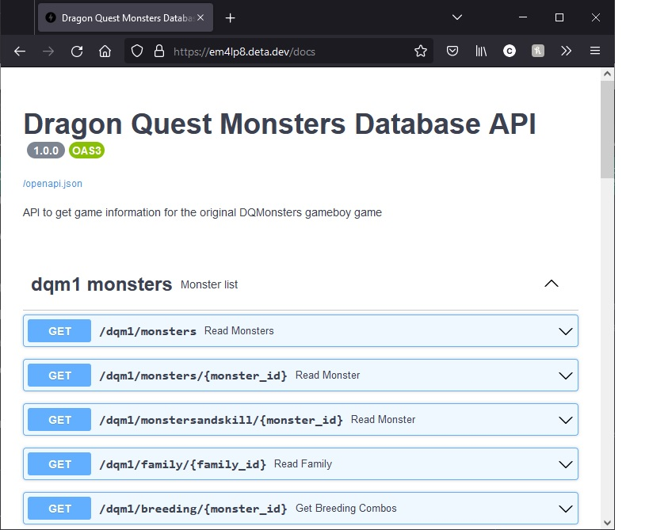
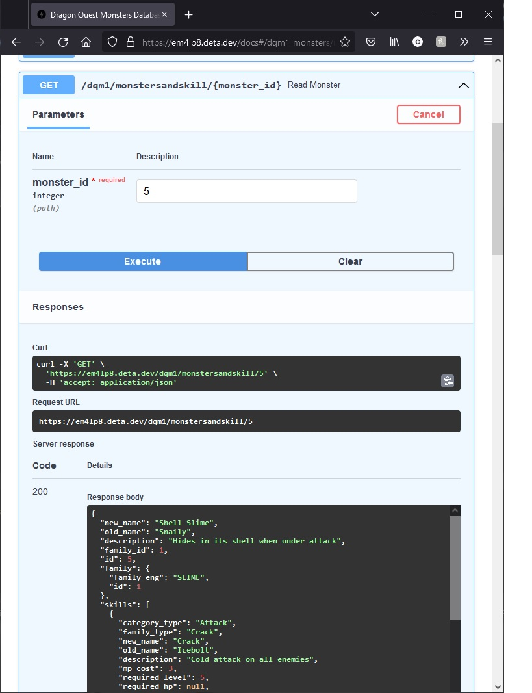

# DQMonstersDB-API

## Intro
Dragon Quest Monsters is a spin-off series based on the famous JRPG series,
Dragon Quest. This database informs the user of game details (monsters, skills,
items, etc.) of [Dragon Quest Monsters -- Terry's Wonderland](https://en.wikipedia.org/wiki/Dragon_Warrior_Monsters)
(also known as Dragon Warrior Monsters in the US).

Released in Japan in 1998 for the Gameboy Color by Enix, it was compared to the
Pokemon series due to their similar gameplay of taming and training monsters
to battle other monsters via random encounters. However, gameplay differs with
its roguelike dungeon levels, the battling system, and the breeding system.

The game is quite old and not many copies are in circulation. The current way
to play the game is to buy "Dragon Quest Monsters -- Terry's Wonderland RETRO"
for the Nintendo Switch on the Japanese Nintendo eShop or on Google Play and
Apple Store by setting your region to Japan (the game will be in Japanese).
Otherwise, use an emulator and download the English version.

## Project Description

This project's purpose is to learn how to make an API with Python by
creating my own wiki website and database. There are some Japanese game wikis
for this particular game, but incredibly frustrating to use and search through.
By putting all the data into a SQL database, it should be easier to access and
find information.

This project is made with FastAPI, a webframework for building APIs with
Python.

## How to Use
This repo is deployed on [Deta Space](https://www.deta.space/), a free cloud platform
recommended by FastAPI on their documentation.

Access the Swagger UI interface of this FastAPI at https://dqmonstersdbapi-1-a1113227.deta.app/docs




## How to Run Locally
1. Clone this repo onto your local machine.
2. Install dependencies onto virtual environment.
3. run `app/create_database.py` to make the sqlite database using the csv files.
database.db file should be generated in the project folder.
4. Run `fastapi dev app/main.py` in the terminal
5. Open http://127.0.0.1:8000 (or http://localhost:8000)
6. Open http://127.0.0.1:8000/docs to access the interactive API
documentation using Swagger UI

```bash
# run commands from the project folder directory
pip install -r requirements.txt

python app/create_database.py

fastapi dev app/main.py
```

## uv package manager
If you are running things with the [uv package manager](https://docs.astral.sh/uv/)
, use the following commands.

```bash
uv sync

uv run python app/create_database.py

uv fastapi dev app/main.py
```

## Docker
If you have docker installed, you can use the `compose.yaml` and `Dockerfile`
to build a docker container with the `docker compose up` command.
Sqlite database will be initialized and data will be added during the build
process.

```bash
# builds image and creates container
docker compose up
```
Go to http://localhost:8000/docs to access the Swagger UI

## Resources used to make project
- FastAPI documentation <https://fastapi.tiangolo.com/>
- SQLModel documentation <https://sqlmodel.tiangolo.com/>
- various issues on the FastAPI github repo
- Deta documentation <https://docs.deta.sh/docs/home>

## Credits
This project is done with help and mentoring by [Bob Belderbos](https://github.com/bbelderbos)
through the [Pybites Developer Mindset Program](https://pybit.es/catalogue/the-pdm-program/)

Thank you Bob for helping me figure out the data models portion.
Creating a many-to-many table with multiple foreign keys was a journey.
